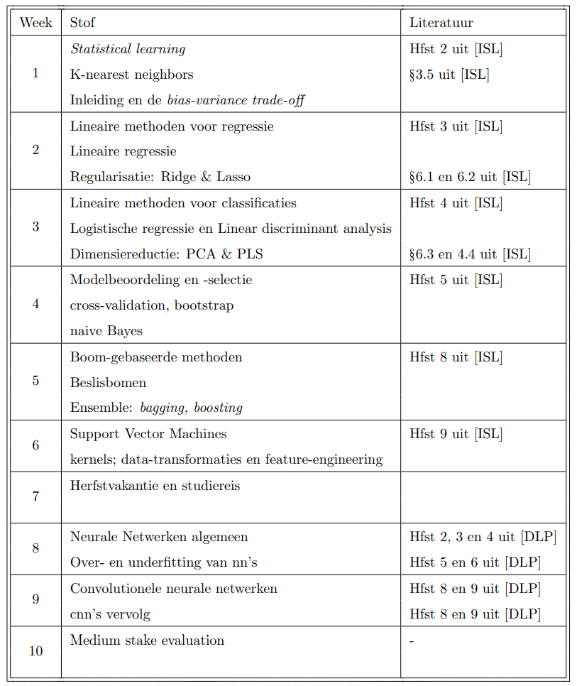
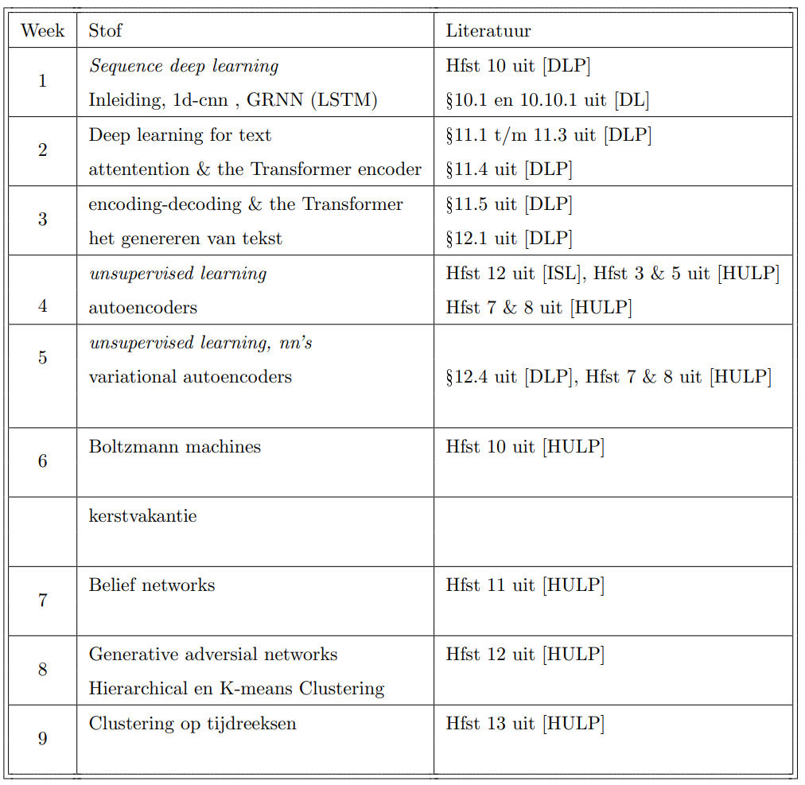

# methoden-en-technieken
ML and DL subjects explained (Dutch)

## Blok 1
Folder blok1-mt describe the basics of supervised ML and -DL. With the schema per week as follows.

## Blok 2
Folder blok1-mt describe the basics of supervised ML and -DL. With the schema per week as follows.

## Literature
[DLP]:  
@book{alma9939375068105132,  
  author = {Chollet, François},  
  address = {Shelter Island, New York},  
  booktitle = {Deep learning with Python},  
  edition = {Second edition.},  
  isbn = {9781638350095},  
  keywords = {Machine learning},  
  language = {eng},  
  publisher = {Manning Publications Co. LLC},  
  title = {Deep learning with Python },  
  year = {2021}  
}  
  
[DL]:  
@book{Goodfellow-et-al-2016,  
  title={Deep Learning},  
  author={Ian Goodfellow and Yoshua Bengio and Aaron Courville},  
  publisher={MIT Press},  
  note={\url{http://www.deeplearningbook.org}},  
  year={2016}  
}  
  
[ISL]:  
@book{James2013,  
  author = {James, Gareth and Witten, Daniela and Hastie, Trevor and Tibshirani, Robert},  
  biburl = {https://www.bibsonomy.org/bibtex/2444186c86d18bddb4433c12fa126f6be/lopusz_kdd},  
  interhash = {b3febabdc45a8629023cee7323dfbd86},  
  intrahash = {444186c86d18bddb4433c12fa126f6be},  
  keywords = {general_machine_learning},  
  publisher = {Springer},  
  timestamp = {2019-10-12T23:45:37.000+0200},  
  title = {An Introduction to Statistical Learning: with Applications in R },  
  url = {https://faculty.marshall.usc.edu/gareth-james/ISL/},  
  year = 2013  
}  
  
[HULP]:  
@book{alma9939160894105132,  
  author = {Patel, Ankur A.},  
  address = {Beijing},  
  booktitle = {Hands-on unsupervised learning using Python : how to build applied machine learning solutions from unlabeled data},  
  edition = {First edition.},  
  isbn = {1-4920-3559-9},  
  keywords = {Python (Computer program language)},  
  language = {eng},  
  publisher = {O'Reilly},  
  title = {Hands-on unsupervised learning using Python : how to build applied machine learning solutions from unlabeled data },  
  year = {2019},  
}  
